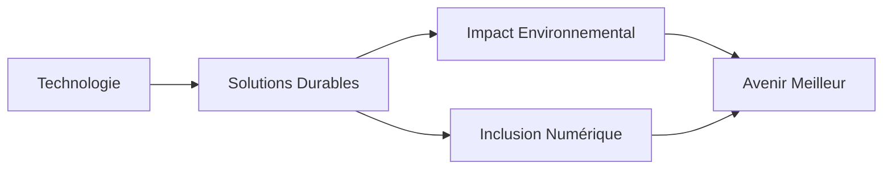

<div align="center">

# 👋 Willson Vulembere

### 🌱 Développeur Full-Stack Web & Mobile

[](https://www.linkedin.com/in/cedryson-vulembere-368a76ba/)
[](https://x.com/willsonantoine)
[](mailto:willsonantoine@gmail.com)

📍 **Goma, République Démocratique du Congo**

</div>

---

## 🚀 À propos de moi

Passionné par la **technologie** et l'**innovation sociale**, je crée des solutions qui ont un impact réel sur l'environnement et les communautés. Mon expertise se concentre sur le développement d'applications web et mobile qui résolvent des problèmes concrets, particulièrement dans les domaines du **climat**, de l'**agriculture** et de la **gestion communautaire**.

## 💼 Projets en cours

<table>
<tr>
<td width="50%">

### 🌿 [Mlinzi IA](https://mlinzi-ia.com)
**Intelligence Artificielle pour l'Agriculture**

- 🤖 Recommandations personnalisées pour la culture
- 📱 Accessible hors ligne
- 🌾 Optimisation des rendements agricoles


</td>
<td width="50%">

### 💧 Système d'Irrigation Intelligent
**IoT pour l'optimisation de l'eau**

- 📊 Capteurs IoT en temps réel
- 💦 Prévention du gaspillage d'eau
- 🌡️ Surveillance environnementale


</td>
</tr>
<tr>
<td width="50%">

### 🤝 [Mlinzi Collecte](https://mcollecte.com/)
**Digitaliser sans bouleverser vos habitudes**

- 💰 Gestion de cotisations & épargnes
- 📱 Application mobile & web
- 🔒 Sécurisé • Hors ligne • Communautaire


</td>
<td width="50%">

### ⚽ [Success Coupon](https://success-coupon.mlinzi-corp.com/)
**Partagez vos pronostics gagnants**

- 🎯 Connexion parieurs experts
- 💸 Monétisation de l'expertise sportive
- 📈 Marketplace de pronostics


</td>
</tr>
<tr>
<td width="50%">

### 🍽️ Système de Prêt Alimentaire
**Solidarité alimentaire digitale**

- 👥 Création de groupes solidaires
- 💵 Dépôts et retraits équivalents
- 🔄 Gestion transparente des contributions


</td>
<td width="50%">

</td>
</tr>
</table>

## 🛠️ Stack Technique

### Frontend


### Backend


### Bases de données


### DevOps & Infrastructure


---

## 📦 Bibliothèques & Packages Open Source

### 📚 [Mcollecte Web Manager Lib](https://github.com/willsonantoine/mcollecte-web-manager-lib)

[](https://badge.fury.io/js/mcollecte-web-manager-lib)
[](https://opensource.org/licenses/MIT)
[](https://www.typescriptlang.org/)

Une bibliothèque TypeScript puissante pour interagir avec l'API publique du système **Mcollecte**. Simplifiez l'intégration de votre site web avec la plateforme Mcollecte.

#### ✨ Fonctionnalités principales

- 🏛️ **Gestion de contenu** - Récupération des informations du site et blocs de contenu
- 📝 **Blog & Catégories** - Gestion complète des articles et catégories
- 🛒 **E-commerce** - Gestion des produits, paniers et commandes
- 👥 **Utilisateurs** - Inscription, connexion, profils et authentification OTP
- 📬 **Contact** - Formulaires de contact intégrés
- 📊 **Staff & Membres** - Récupération des membres et équipes
- 🔒 **Sécurisé & Typé** - Types TypeScript complets pour une meilleure DX

#### 🚀 Installation

```bash
npm install mcollecte-web-manager-lib
# ou
yarn add mcollecte-web-manager-lib
```

#### 💻 Exemple d'utilisation

```typescript
import McollectWebManagerLib from 'mcollecte-web-manager-lib';

const client = new McollectWebManagerLib({
  api_url: process.env.API_URL,
  site_token: process.env.SITE_TOKEN
});

// Récupérer les articles de blog
const blogs = await client.getBlogs();

// Récupérer un produit
const products = await client.getProduct({ search: 'laptop' });

// Créer une commande
const order = await client.commande({
  phoneNumber: '+243123456789',
  payementMethod: 'mobile',
  lines: [{ productId: 'xxx', quantity: 2 }]
});
```

🔗 **[Voir la documentation complète](https://github.com/willsonantoine/mcollecte-web-manager-lib)**

---

### 🎨 [VulembereIcons](https://github.com/Vulembere/VulembereIcons)

[](https://openjfx.io/)
[](https://gluonhq.com/products/scene-builder/)
[](https://github.com/Vulembere/VulembereIcons)

Une application desktop open source qui révolutionne le design JavaFX avec **Scene Builder**. VulembereIcons regroupe des milliers d'icônes (FontAwesome, Material Design Icons, Weather Icons) dans une interface moderne avec barre de recherche.

#### ✨ Pourquoi VulembereIcons ?

- 🔍 **Barre de recherche intégrée** - Trouvez rapidement l'icône parfaite (contrairement à fontawesomefx-glyphsbrowser-all-1.0)
- 🎯 **Compatible toutes versions JDK** - Résout les problèmes de compatibilité Java
- 📦 **3 bibliothèques d'icônes** - FontAwesome, Material Design, Weather Icons
- 🎨 **Intégration Scene Builder** - Utilisez directement dans vos projets JavaFX
- ⚡ **Interface intuitive** - Navigation fluide et prévisualisation instantanée

#### 📥 Téléchargement

```bash
# Télécharger l'exécutable Windows
wget https://github.com/Vulembere/VulembereIcons/raw/master/Output/VulembereIcon.exe
```

🔗 **[Voir le projet sur GitHub](https://github.com/Vulembere/VulembereIcons)**

---

### 💾 [Mlinzi Auto Backup](https://github.com/willsonantoine/auto-backup-python)

[](https://www.python.org/)
[](https://www.mysql.com/)
[](https://github.com/willsonantoine/auto-backup-python)

Une application desktop open source pour **automatiser les sauvegardes MySQL**. Solution complète, facile à utiliser et personnalisable pour sécuriser vos bases de données avec planification automatique.

#### 🌟 Fonctionnalités principales

- ⚙️ **Configuration flexible** - Chemin mysqldump, hôte, port, utilisateur, mot de passe
- 🗄️ **Sélection intelligente** - Chargement automatique des bases de données disponibles
- 📁 **Gestion avancée** - Choix du répertoire de destination pour les sauvegardes
- 🔄 **Sauvegardes automatiques** - Planification à intervalles réguliers
- ⏱️ **Compte à rebours** - Affichage du temps avant la prochaine sauvegarde
- 📊 **Suivi en temps réel** - Barre de progression et logs détaillés
- 📤 **Export facile** - Exportation vers stockage externe
- 🚀 **Démarrage auto** - Lancement au démarrage de Windows
- 🔔 **Notification sonore** - Bip à la fin de chaque sauvegarde
- 📅 **Fichiers horodatés** - Organisation automatique par date/heure
- 📖 **Documentation intégrée** - Modal d'aide accessible

#### 💡 Cas d'utilisation

```python
# Configuration simple
- Configurez votre connexion MySQL
- Sélectionnez la base de données
- Définissez l'intervalle de sauvegarde
- Activez l'auto-backup
- Vos données sont protégées automatiquement !
```

🔗 **[Voir le projet sur GitHub](https://github.com/willsonantoine/auto-backup-python)**

---

### 🧠 [VulembAIGenerator](https://github.com/willsonantoine/VulembAIGenerator)

[](https://www.npmjs.com/package/vulembai-generator)
[](https://www.typescriptlang.org/)
[](https://openai.com/)
[](https://opensource.org/licenses/MIT)

Une bibliothèque TypeScript puissante pour **générer du contenu avec les modèles GPT d'OpenAI**. Automatisez la création de texte, générez des idées, et améliorez vos applications avec l'IA.

#### ✨ Fonctionnalités

- 🤖 **Intégration OpenAI** - Accès direct aux modèles GPT (GPT-3.5, GPT-4)
- 📝 **Génération de texte** - Création automatique de contenu
- ⚡ **API simple** - Interface intuitive et facile à utiliser
- 🔒 **Types TypeScript** - Sécurité et autocomplétion
- 🎯 **Personnalisable** - Paramètres flexibles pour chaque génération

#### 🚀 Installation

```bash
npm install vulembai-generator
```

🔗 **[Voir le projet sur GitHub](https://github.com/willsonantoine/VulembAIGenerator)**

---

### 📊 [ExcelGuru AI](https://github.com/willsonantoine/ExcelGuru-AI)

[](https://www.typescriptlang.org/)
[](https://github.com/willsonantoine/ExcelGuru-AI)
[](https://opensource.org/licenses/MIT)

Une application intelligente pour **analyser vos fichiers Excel avec l'IA**. Générez des graphiques modernes, obtenez des analyses détaillées et recevez des recommandations personnalisées.

#### ✨ Capacités

- 📈 **Graphiques modernes** - Visualisations interactives et attrayantes
- 🔍 **Analyses détaillées** - Insights profonds sur vos données
- 🧠 **Recommandations IA** - Suggestions intelligentes basées sur vos données
- 📄 **Import Excel** - Support complet des fichiers .xlsx
- 🎨 **Interface moderne** - UX intuitive et professionnelle

🔗 **[Voir le projet sur GitHub](https://github.com/willsonantoine/ExcelGuru-AI)**

---

### 👩‍⚕️ [CycleWise API](https://github.com/willsonantoine/Menstrual-Cycle-Tracking-App-Backend-api)

[](https://nodejs.org/)
[](https://www.typescriptlang.org/)
[](https://github.com/willsonantoine/Menstrual-Cycle-Tracking-App-Backend-api)

API backend robuste développée avec **Node.js et TypeScript** pour le **suivi du cycle menstruel**. Permet aux femmes de suivre leur cycle, d'enregistrer leurs symptômes et de recevoir des conseils personnalisés.

#### ✨ Fonctionnalités santé

- 📅 **Suivi du cycle** - Calendrier menstruel intelligent
- 🌡️ **Enregistrement symptômes** - Journal de santé détaillé
- 📊 **Analyses & statistiques** - Visualisation des patterns
- 🔔 **Notifications** - Rappels et alertes personnalisés
- 📝 **Conseils personnalisés** - Recommandations adaptées
- 🔒 **Sécurité & confidentialité** - Données de santé protégées

🔗 **[Voir le projet sur GitHub](https://github.com/willsonantoine/Menstrual-Cycle-Tracking-App-Backend-api)**

---

### 📦 Autres bibliothèques

<table>
<tr>
<td width="50%">

#### 📚 [FXVulembereList](https://github.com/willsonantoine/FXVulembereList)


**Liste dynamique pour JavaFX**  
Composant réutilisable pour créer des listes interactives dans vos applications JavaFX.

</td>
<td width="50%">

#### 📝 [Swagger API Node.js](https://github.com/willsonantoine/swagger-api-nodejs)


**Documentation API interactive**  
Exemple d'implémentation Swagger pour documenter et tester vos APIs Node.js.

</td>
</tr>
<tr>
<td width="50%">

#### 🛠️ [ORM PHP](https://github.com/willsonantoine/orm-php)


**Bibliothèque ORM MySQL**  
Facilite la création et modification de tables MySQL avec PHP.

</td>
<td width="50%">

#### 💾 [Mlinzi Lib](https://github.com/willsonantoine/mlinzi-lib)


**Gestion de base de données PHP**  
Bibliothèque gratuite pour gérer l'accès aux bases de données avec un code simple.

</td>
</tr>
<tr>
<td width="50%">

#### 🚀 [Laravel Inited App](https://github.com/willsonantoine/laravel-inited-app)


**Application Laravel pré-configurée**  
Structure MVC robuste avec routing, migrations, Eloquent ORM et configuration environnement.

</td>
<td width="50%">

#### 🔌 [Socket Server Node.js](https://github.com/willsonantoine/socket_server_nodejs)


**Serveur WebSocket temps réel**  
Application de serveur de sockets avec Node.js et PostgreSQL pour messagerie.

</td>
</tr>
</table>


## 🌍 Mission & Vision

> *"Utiliser la technologie pour créer un impact positif sur l'environnement et les communautés"*



🌱 **Développement Durable** • 🤝 **Impact Social** • 💡 **Innovation Accessible**

---

## 📊 GitHub Stats

<div align="center">


</div>

---

## 📬 Restons en contact

<div align="center">

💼 Ouvert aux collaborations et opportunités freelance

[](https://www.linkedin.com/in/cedryson-vulembere-368a76ba/)
[](https://x.com/willsonantoine)
[](mailto:willsonantoine@gmail.com)

---

⭐ **Merci de visiter mon profil !** N'hésitez pas à explorer mes projets et à me contacter pour toute collaboration.


</div>

